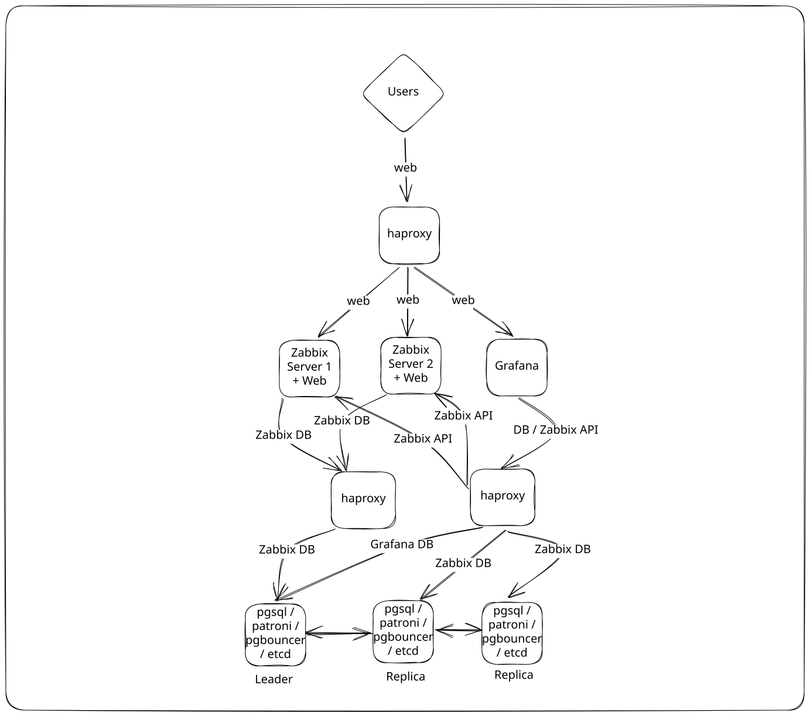

# Обзор Zabbix Demo
В этом демо настроим работу Zabbix-сервер в отказоустойчивой конфигурации с автоматическим переключением на резервный сервер PostgreSQL. А еще подключим Grafana в оптимальной конфигурации (с использованием DirectDB connection). Окружение тестировалось на серверах Ubuntu 24.04.

В репозитории вы найдете:
* документацию по установке и настройке компонентов
* примеры конфигурационных файлов
* процедуры тестирования отказоустойчивости


### Что будем использовать

| Компонент           | Назначение                  |
| ------------- | --------------------------- |
| PostgreSQL 18.4 | БД      |
| Patroni 4.1.3 | Оркестрация PostgreSQL |
| ETCD 3.4.30 | Распределенное хранилище состояния кластера|
|PGBouncer 1.25.2|Пулер соединений для PostgreSQL|
| Zabbix 7.4.13    | Мониторинг         |
|Nginx 1.24.0| Веб-сервер|
|PHP-FPM 8.3.6| Менеджер процессов PHP|
| HAProxy 2.8.16 | Балансировщик нагрузки     |
| Grafana 13.1.1 | Визуализация данных |


### Как будет выглядеть архитектура
Так будет выглядеть итоговая архитектура демо-инсталляции



### Где будем разворачивать
Для работы окружения нам понадобится 7 серверов.

| Компонент          | Количество | Имя сервера | IP адреса |
| --------------------- | ----- | --------------------- | --------------------- | 
| PostgreSQL      | 3     | pg01, pg02, pg03 | 192.168.0.20, 192.168.0.21, 192.168.0.22|
| Zabbix сервер   | 2     | zbx01, zbx02     | 192.168.0.10, 192.168.0.11|
| HAProxy         | 1     | haproxy          | 192.168.0.2 | 
| Grafana         | 1     | grafana          | 192.168.0.3 | 


### Последовательность действий

Установку и настройку будем выполнять в следующем порядке:

1. Настройка сетевого подключения и разрешения имен хостов.
2. Установка и настройка кластера ETCD.
3. Установка и настройка PostgreSQL 18.
4. Настройка управления кластером Patroni
5. Настройка репликации и отказоустойчивости PostgreSQL.
6. Проверка высокой доступности PostgreSQL
7. Установка и настройка PGBouncer.
8. Установка и настройка Zabbix-серверов.
9. Настройка Zabbix HA.
10. Настройка балансировки нагрузки на стороне фронтенда HAProxy.
11. Проверка отказоустойчивости.


# Настройка Zabbix Demo

### Настройка сетевого подключения и разрешения имен хостов
На каждом сервере обновим ```/etc/hosts```, добавив записи.

```
cat << EOF >> /etc/hosts
192.168.0.2    haproxy
192.168.0.3    grafana
192.168.0.10   zbx01
192.168.0.11   zbx02
192.168.0.20   pg01
192.168.0.21   pg02
192.168.0.22   pg03
EOF
```
### Установка компонентов БД: etcd, PostgreSQL, Patroni, TimescaleDB, PGBouncer
#### Установка и настройка кластера ETCD

Установите компоненты etcd
```
apt update
apt install etcd-server etcd-client
```
Отредактируйте конфигурацию etcd на каждой ноде: pg01, pg02, pg03
```
nano /etc/default/etcd
```
На ноде pg01
```
cat << EOF >> /etc/default/etcd
ETCD_NAME="pg01"
ETCD_DATA_DIR="/var/lib/etcd"
ETCD_INITIAL_ADVERTISE_PEER_URLS="http://192.168.0.20:2380"
ETCD_LISTEN_PEER_URLS="http://192.168.0.20:2380"
ETCD_LISTEN_CLIENT_URLS="http://192.168.0.20:2379,http://127.0.0.1:2379"
ETCD_ADVERTISE_CLIENT_URLS="http://192.168.0.20:2379"
ETCD_INITIAL_CLUSTER="pg01=http://192.168.0.20:2380,pg02=http://192.168.0.21:2380,pg03=http://192.168.0.22:2380"
ETCD_INITIAL_CLUSTER_TOKEN="zabbix-etcd-cluster"
ETCD_INITIAL_CLUSTER_STATE="new"
EOF
```
На ноде pg02
```
cat << EOF >> /etc/default/etcd
TCD_NAME="pg02"
ETCD_DATA_DIR="/var/lib/etcd"
ETCD_INITIAL_ADVERTISE_PEER_URLS="http://192.168.0.21:2380"
ETCD_LISTEN_PEER_URLS="http://192.168.0.21:2380"
ETCD_LISTEN_CLIENT_URLS="http://192.168.0.21:2379,http://127.0.0.1:2379"
ETCD_ADVERTISE_CLIENT_URLS="http://192.168.0.21:2379"
ETCD_INITIAL_CLUSTER="pg01=http://192.168.0.20:2380,pg02=http://192.168.0.21:2380,pg03=http://192.168.0.22:2380"
ETCD_INITIAL_CLUSTER_TOKEN="zabbix-etcd-cluster"
ETCD_INITIAL_CLUSTER_STATE="new"
EOF
```
На ноде pg03
```
cat << EOF >> /etc/default/etcd
ETCD_NAME="pg03"
ETCD_DATA_DIR="/var/lib/etcd"
ETCD_INITIAL_ADVERTISE_PEER_URLS="http://192.168.0.22:2380"
ETCD_LISTEN_PEER_URLS="http://192.168.0.22:2380"
ETCD_LISTEN_CLIENT_URLS="http://192.168.0.22:2379,http://127.0.0.1:2379"
ETCD_ADVERTISE_CLIENT_URLS="http://192.168.0.22:2379"
ETCD_INITIAL_CLUSTER="pg01=http://192.168.0.20:2380,pg02=http://192.168.0.21:2380,pg03=http://192.168.0.22:2380"
ETCD_INITIAL_CLUSTER_TOKEN="zabbix-etcd-cluster"
ETCD_INITIAL_CLUSTER_STATE="new"
EOF
```
На каждой ноде добавьте etcd в автозагрузку и запустите его
```
systemctl enable --now etcd
```
Проверьте текущий статус etcd
```
etcdctl endpoint health --cluster=true
```
На этом установка etcd завершена.

#### Установка PostgreSQL

Все действия, описанные в этом разделе, выполняются на 3 серверах БД: pg01, pg02, pg03.
Начнем с установки БД PostgreSQL. Добавим репозиторий.

Для Ubuntu 24.04 LTS наиболее правильный способ установки PostgreSQL 18.4 — использовать официальный репозиторий PostgreSQL Global Development Group (PGDG). Он содержит актуальные версии PostgreSQL.

Установитн нужные пакеты
```
apt install -y curl ca-certificates postgresql-common
```
Подключите официальный репозиторий PostgreSQL (скрипт автоматом определит версию Ubuntu, добавит репозиторий, импортирует GPG-ключ, выполнит `apt update`)
```
/usr/share/postgresql-common/pgdg/apt.postgresql.org.sh
```
Установите пакет БД
```
apt install -y postgresql-18
```
Проверьте установленную версию
```
psql --version
```
Так как для управления БД мы будем использовать Patroni, нужно остановить сервис СУБД, удалить его из автозагрузки и удалить созданный кластер.
```
systemctl disable postgresql --now
pg_dropcluster --stop 18 main
```
На этом установка БД завершена.
#### Установка Patroni

Все действия, описанные в этом разделе, выполняются на 3 серверах БД: pg01, pg02, pg03.
Установите Patroni
```
apt install -y patroni
```
Отредактируйте конфигурацию Patroni
```
nano /etc/patroni/config.yml
```
На ноде pg01
```
scope: postgres-cluster
namespace: /service/
name: pg01

restapi:
  listen: 0.0.0.0:8008
  connect_address: 192.168.0.20:8008

etcd3:
  hosts:
    - 192.168.0.20:2379
    - 192.168.0.21:2379
    - 192.168.0.22:2379

bootstrap:
  dcs:
    ttl: 30
    loop_wait: 10
    retry_timeout: 10
    maximum_lag_on_failover: 1048576

    postgresql:
      use_pg_rewind: true
      use_slots: true
      parameters:
        wal_level: replica
        hot_standby: "on"
        max_connections: 200
        max_wal_senders: 10
        max_replication_slots: 10
        wal_keep_size: 512MB
        shared_buffers: 1GB

  initdb:
    - encoding: UTF8
    - data-checksums

  pg_hba:
    - host all all 0.0.0.0/0 md5
    - host replication replicator 192.168.0.0/24 md5

  users:
    admin:
      password: 2tdxZ898D9MR
      options:
        - createrole
        - createdb

postgresql:
  listen: 0.0.0.0:5432
  connect_address: 192.168.0.20:5432
  data_dir: /var/lib/postgresql/18/main
  bin_dir: /usr/lib/postgresql/18/bin

  authentication:
    superuser:
      username: postgres
      password: 2tdxZ898D9MR
    replication:
      username: replicator
      password: 2tdxZ898D9MR

  parameters:
    unix_socket_directories: /var/run/postgresql

tags:
  nofailover: false
  noloadbalance: false
  clonefrom: false
  nosync: false
```
На ноде pg02
```
scope: postgres-cluster
namespace: /service/
name: pg02

restapi:
  listen: 0.0.0.0:8008
  connect_address: 192.168.0.21:8008

etcd3:
  hosts:
    - 192.168.0.20:2379
    - 192.168.0.21:2379
    - 192.168.0.22:2379

bootstrap:
  dcs:
    ttl: 30
    loop_wait: 10
    retry_timeout: 10
    maximum_lag_on_failover: 1048576

    postgresql:
      use_pg_rewind: true
      use_slots: true
      parameters:
        wal_level: replica
        hot_standby: "on"
        max_connections: 200
        max_wal_senders: 10
        max_replication_slots: 10
        wal_keep_size: 512MB
        shared_buffers: 1GB

  initdb:
    - encoding: UTF8
    - data-checksums

  pg_hba:
    - host all all 0.0.0.0/0 md5
    - host replication replicator 192.168.0.0/24 md5

  users:
    admin:
      password: 2tdxZ898D9MR
      options:
        - createrole
        - createdb

postgresql:
  listen: 0.0.0.0:5432
  connect_address: 192.168.0.21:5432
  data_dir: /var/lib/postgresql/18/main
  bin_dir: /usr/lib/postgresql/18/bin

  authentication:
    superuser:
      username: postgres
      password: 2tdxZ898D9MR
    replication:
      username: replicator
      password: 2tdxZ898D9MR

  parameters:
    unix_socket_directories: /var/run/postgresql

tags:
  nofailover: false
  noloadbalance: false
  clonefrom: false
  nosync: false
```
На ноде pg03
```
scope: postgres-cluster
namespace: /service/
name: pg03

restapi:
  listen: 0.0.0.0:8008
  connect_address: 192.168.0.22:8008

etcd3:
  hosts:
    - 192.168.0.20:2379
    - 192.168.0.21:2379
    - 192.168.0.22:2379

bootstrap:
  dcs:
    ttl: 30
    loop_wait: 10
    retry_timeout: 10
    maximum_lag_on_failover: 1048576

    postgresql:
      use_pg_rewind: true
      use_slots: true
      parameters:
        wal_level: replica
        hot_standby: "on"
        max_connections: 200
        max_wal_senders: 10
        max_replication_slots: 10
        wal_keep_size: 512MB
        shared_buffers: 1GB

  initdb:
    - encoding: UTF8
    - data-checksums

  pg_hba:
    - host all all 0.0.0.0/0 md5
    - host replication replicator 192.168.0.0/24 md5

  users:
    admin:
      password: 2tdxZ898D9MR
      options:
        - createrole
        - createdb

postgresql:
  listen: 0.0.0.0:5432
  connect_address: 192.168.0.22:5432
  data_dir: /var/lib/postgresql/18/main
  bin_dir: /usr/lib/postgresql/18/bin

  authentication:
    superuser:
      username: postgres
      password: 2tdxZ898D9MR
    replication:
      username: replicator
      password: 2tdxZ898D9MR

  parameters:
    unix_socket_directories: /var/run/postgresql

tags:
  nofailover: false
  noloadbalance: false
  clonefrom: false
  nosync: false
```
Перезагрузите Patroni
```
systemctl enable patroni --now
```
Убедитесь, что Patroni видит все ноды. В ответе вы должны увидеть 3 ноды кластера.
```
patronictl -c /etc/patroni/config.yml list
```
На этом установка Patroni завершена.
#### Установка TimescaleDB
Добавьте репозиторий TimescaleDB (выполните на 3 серверах БД: pg01, pg02, pg03)
```
curl -fsSL https://packagecloud.io/timescale/timescaledb/gpgkey | sudo gpg --dearmor -o /usr/share/keyrings/timescaledb-archive-keyring.gpg
echo "deb [signed-by=/usr/share/keyrings/timescaledb-archive-keyring.gpg] \
https://packagecloud.io/timescale/timescaledb/ubuntu/ noble main" | sudo tee /etc/apt/sources.list.d/timescaledb.list
apt update
apt install -y timescaledb-2-postgresql-18
```
Так как управление кластером происходит через Patroni, необходимо подключить расширение TimescaleDB. Отредактируйте конфигурацию Patroni и добавьте расширение TimescaleDB
```
patronictl -c /etc/patroni/config.yml edit-config
```
Нужно встроить в файл следующую конструкцию
```
postgresql:
  parameters:
    shared_preload_libraries: timescaledb
```
После этого перезагрузить последовательно ноды PostgreSQL. Начните с реплик и закончите лидером.
```
patronictl -c /etc/patroni/config.yml restart postgres-cluster pg02
patronictl -c /etc/patroni/config.yml restart postgres-cluster pg03
patronictl -c /etc/patroni/config.yml restart postgres-cluster pg01
```
После перезагрузки убедитесь, что расширение загрузилось
```
sudo -u postgres psql -h 127.0.0.1 -p 5432 -d postgres
SHOW shared_preload_libraries;
```


#### Установка PGBouncer
Установите PGBouncer (выполните на 3 серверах БД: pg01, pg02, pg03), добавьте его в автозагрузку и остановите
```
apt install -y pgbouncer
systemctl enable pgbouncer
systemctl stop pgbouncer
```

Создайте необходимые роли Zabbix и базы данных. Необходимо создать 2 базы (zabbix_server и grafana), а также 4 роли:
`zabbix_srv` будет использоваться для подключения Zabbix Server к БД Zabbix
`zabbix_web` будет использоваться для подключения Zabbix Frontend к БД Zabbix. Создайте отдельного пользователя Zabbix Frontend для упрощения диагностики работы БД в будущем.
`grafana_zabbix` будет использоваться для подключения Grafana к БД Zabbix
`grafana` будет использоваться для подключения Grafana к БД Grafana
```
PGPASSWORD='2tdxZ898D9MR' \
psql \
  -h 127.0.0.1 \
  -p 5432 \
  -U postgres

CREATE ROLE zabbix_srv LOGIN PASSWORD '2tdxZ898D9MR';
CREATE ROLE zabbix_web LOGIN PASSWORD '2tdxZ898D9MR';
CREATE ROLE grafana_zabbix LOGIN PASSWORD '2tdxZ898D9MR';
CREATE ROLE grafana LOGIN PASSWORD '2tdxZ898D9MR';
CREATE DATABASE zabbix_server OWNER zabbix_srv;
CREATE DATABASE grafana OWNER 'grafana';
```
Получиnt SCRAM-секреты пользователей (понадобятся для работы PGBouncer)
SELECT rolname || '|' || rolpassword FROM pg_authid WHERE rolname IN ('zabbix_srv', 'zabbix_web', 'grafana', 'grafana_zabbix');

Добавьте записи в конфигурационный файл /etc/pgbouncer/userlist.txt (выполните на 3 серверах БД: pg01, pg02, pg03). В вашем случае хэши паролей будут отличаться.
```
nano /etc/pgbouncer/userlist.txt 
"zabbix_srv" "SCRAM-SHA-256$4096:Dt2pydTlGUvc9CckB8EGBw==$d6z6YYLy+A8B3bdxucXDVpg85gl84tIJehhIyHuVvwg=:R9NctBV2LcaXql3PsNDp3YuFjDVX2KftF9C2IENK3uE="
"zabbix_web" "SCRAM-SHA-256$4096:AR8hHO9nLBjrZitlANy8IQ==$0qABD5ghyOyc8dmMZblvVV+SC22FNJsHkqP42y+I2dw=:MhL0utZXPhspp+QjsOoSyDfSlkaXM4vRkg31Zz5VCxA="
"grafana_zabbix" "SCRAM-SHA-256$4096:vOLwdJq2iQlAErxB/tmr3Q==$aGsEz/IDYGMWpircIyLuXJ5iZSKZqv1eFRQW7rgA2FA=:Gh+NhWMdjFPlgjo94WcB8bamojLi3vN4Jyf/RG10MKU="
"grafana" "SCRAM-SHA-256$4096:kHvnLIdYr4iXTNNpvxlOxQ==$T9fv3QwJEgpHf5geLicCJX5CO+lln/7AC29ev8GinKU=:xSoqpjhYH/nkHuvWH7R5cSHFaE29HOL3ekwLEB6pAg0="
```
Установите права на конфигурационный файл (выполните на 3 серверах БД: pg01, pg02, pg03)
```
chown postgres:postgres /etc/pgbouncer/userlist.txt
chmod 600 /etc/pgbouncer/userlist.txt
```

Модифицируйте файл /etc/pgbouncer/pgbouncer.ini (выполните на 3 серверах БД: pg01, pg02, pg03), добавив/изменив значения в соответствующих секциях
```
nano /etc/pgbouncer/pgbouncer.ini
[databases]
zabbix_server = host=127.0.0.1 port=5432 dbname=zabbix_server
grafana = host=127.0.0.1 port=5432 dbname=grafana pool_mode=session
[pgbouncer]
listen_addr = 0.0.0.0
auth_type = scram-sha-256
pool_mode = transaction
max_client_conn = 500
default_pool_size = 100
```
 
Перезагрузите PGBouncer (выполните на 3 серверах БД: pg01, pg02, pg03)
```
systemctl restart pgbouncer
```
Проверьте подключение (выполните на 3 серверах БД: pg01, pg02, pg03)
```
PGPASSWORD='2tdxZ898D9MR' \
psql \
  -h 127.0.0.1 \
  -p 6432 \
  -U zabbix_srv \
  -d zabbix_server \
  -c "SELECT current_user, pg_is_in_recovery();"
```
На репликах в столбце pg_is_in_recovery получите t, а на лидере f.


### Установка Haproxy
На сервере `haproxy` выполните скрипт. Скрипт установит и запустит haproxy, создаст сертификаты Let's Encrypt а также применит необходимую конфигурацию.
```
#!/usr/bin/env bash
set -euo pipefail

DOMAIN="haproxy.gals.training"
EMAIL="admin@gals.training"

# Приватный IP HAProxy-сервера
HAPROXY_PRIVATE_IP="192.168.0.2"

# Zabbix frontend nodes
ZABBIX_NODE1="192.168.0.10"
ZABBIX_NODE2="192.168.0.11"

# Patroni PostgreSQL nodes
PG01="192.168.0.20"
PG02="192.168.0.21"
PG03="192.168.0.22"

CERT_DIR="/etc/haproxy/certs"
CERT_PEM="${CERT_DIR}/${DOMAIN}.pem"

apt update
apt install -y haproxy certbot ca-certificates curl

systemctl stop haproxy || true

certbot certonly \
  --standalone \
  --non-interactive \
  --agree-tos \
  --email "${EMAIL}" \
  -d "${DOMAIN}"

mkdir -p "${CERT_DIR}"

cat \
  "/etc/letsencrypt/live/${DOMAIN}/fullchain.pem" \
  "/etc/letsencrypt/live/${DOMAIN}/privkey.pem" \
  > "${CERT_PEM}"

chown haproxy:haproxy "${CERT_PEM}"
chmod 600 "${CERT_PEM}"

cp /etc/haproxy/haproxy.cfg "/etc/haproxy/haproxy.cfg.bak.$(date +%F-%H%M%S)"

cat > /etc/haproxy/haproxy.cfg <<EOF
global
    log /dev/log local0
    log /dev/log local1 notice

    user haproxy
    group haproxy

    maxconn 5000
    daemon

    ssl-default-bind-options ssl-min-ver TLSv1.2

defaults
    log global

    timeout connect 5s
    timeout client 1h
    timeout server 1h
    timeout check 3s

##########################################################
# HTTP -> HTTPS
##########################################################

frontend http_frontend
    bind *:80
    mode http

    option httplog

    http-request redirect scheme https code 301

##########################################################
# HTTPS frontend
##########################################################

frontend monitoring_https
    bind *:443 ssl crt /etc/haproxy/certs/haproxy.gals.training.pem
    mode http

    option httplog
    option forwardfor

    http-request set-header X-Forwarded-Proto https
    http-request set-header X-Forwarded-Port 443
    http-request set-header X-Forwarded-Host %[req.hdr(Host)]

    acl root_path path -i /
    acl zabbix_no_slash path -i /zabbix
    acl grafana_no_slash path -i /grafana
    acl path_zabbix path_beg -i /zabbix/
    acl path_grafana path_beg -i /grafana/

    http-request redirect location /zabbix/ code 302 if root_path
    http-request redirect location /zabbix/ code 301 if zabbix_no_slash
    http-request redirect location /grafana/ code 301 if grafana_no_slash

    use_backend zabbix_servers if path_zabbix
    use_backend grafana_server if path_grafana

##########################################################
# Zabbix Frontend
##########################################################

backend zabbix_servers
    mode http
    balance roundrobin

    option httpchk GET /zabbix.php
    http-check expect status 200

    default-server inter 5s fall 3 rise 2

    # Убираем /zabbix перед передачей запроса на Nginx Zabbix.
    # /zabbix/index.php -> /index.php
    http-request set-path %[path,regsub(^/zabbix/?/,/)]

    http-request set-header X-Forwarded-Prefix /zabbix

    server zabbix-node1 192.168.0.10:80 check
    server zabbix-node2 192.168.0.11:80 check

##########################################################
# Grafana
##########################################################

backend grafana_server
    mode http

    option httpchk GET /api/health
    http-check expect status 200

    default-server inter 5s fall 3 rise 2

    # Для Grafana префикс не удаляем:
    # сама Grafana будет настроена для работы из /grafana
    http-request set-header X-Forwarded-Prefix /grafana
    http-request set-header X-Forwarded-Proto https
    http-request set-header X-Forwarded-Host %[req.hdr(Host)]

    server grafana 192.168.0.3:3000 check

##########################################################
# PostgreSQL replicas — Grafana Direct DB
##########################################################

listen postgres-replicas
    bind 192.168.0.2:5433

    mode tcp
    option tcplog
    balance roundrobin

    option httpchk GET /replica
    http-check expect status 200

    default-server inter 2s fall 3 rise 2 on-marked-down shutdown-sessions

    server pg01 192.168.0.20:6432 check port 8008
    server pg02 192.168.0.21:6432 check port 8008
    server pg03 192.168.0.22:6432 check port 8008

##########################################################
# PostgreSQL Patroni Leader
##########################################################

listen postgres-primary
    bind 192.168.0.2:5432

    mode tcp
    option tcplog
    balance first

    option httpchk GET /primary
    http-check expect status 200

    default-server inter 2s fall 3 rise 2 on-marked-down shutdown-sessions

    server pg01 192.168.0.20:6432 check port 8008
    server pg02 192.168.0.21:6432 check port 8008
    server pg03 192.168.0.22:6432 check port 8008

##########################################################
# HAProxy Stats
##########################################################

listen stats
    bind 127.0.0.1:7000

    mode http

    stats enable
    stats uri /
    stats refresh 5s
    stats auth admin:admin
EOF

haproxy -c -f /etc/haproxy/haproxy.cfg

systemctl enable haproxy
systemctl restart haproxy

cat > /etc/letsencrypt/renewal-hooks/deploy/reload-haproxy.sh <<EOF
#!/usr/bin/env bash
set -e

cat /etc/letsencrypt/live/${DOMAIN}/fullchain.pem \\
    /etc/letsencrypt/live/${DOMAIN}/privkey.pem \\
    > ${CERT_PEM}

chown haproxy:haproxy ${CERT_PEM}
chmod 600 ${CERT_PEM}

systemctl reload haproxy

chmod +x /etc/letsencrypt/renewal-hooks/deploy/reload-haproxy.sh

systemctl status haproxy --no-pager

echo
echo "Проверка портов:"
ss -ltnp | grep -E ':80|:443|:5432|:7000' || true

echo
echo "Готово."
echo "Zabbix HTTPS: https://${DOMAIN}"
echo "PostgreSQL endpoint: ${HAPROXY_PRIVATE_IP}:5432"
```


### Установка Zabbix Server, Zabbix Frontend

Установите клиент PostgreSQL и утилиту curl на обоих серверах Zabbix (zbx01, zbx02). Они нам пригодятся при дальнейшем тестировании подключения.
```
apt update
apt install -y curl postgresql-common
/usr/share/postgresql-common/pgdg/apt.postgresql.org.sh
apt install -y postgresql-client-18
```
Добавьте репозиторий Zabbix (выполните на zbx01, zbx02)
```
wget https://repo.zabbix.com/zabbix/7.4/release/ubuntu/pool/main/z/zabbix-release/zabbix-release_latest+ubuntu24.04_all.deb
dpkg -i zabbix-release_latest+ubuntu24.04_all.deb
apt update
```
Установите компоненты Zabbix
```
apt install -y \
  zabbix-server-pgsql \
  zabbix-frontend-php \
  zabbix-nginx-conf \
  zabbix-sql-scripts \
  zabbix-agent2 \
  php8.3-pgsql
```
Первичное создание базы и импорт лучше выполнять напрямую через порт PostgreSQL 5432 текущего Leader, а не через PgBouncer. Это исключает влияние пула и смену backend во время длительного импорта. Проверьте кто сейчас является лидером
```
patronictl -c /etc/patroni/config.yml list
```
Проверьте прямое подключение к БД через haproxy с обоих Zabbix-серверов
PGPASSWORD='2tdxZ898D9MR' \
psql \
  -h "192.168.0.2" \
  -p 5432 \
  -U zabbix_srv \
  -d zabbix_server \
  -c "SELECT current_user, current_database(), pg_is_in_recovery();"

Импортируйте основную схему Zabbix
```
zcat /usr/share/zabbix/sql-scripts/postgresql/server.sql.gz \
| PGPASSWORD='2tdxZ898D9MR' \
  psql \
    -h "192.168.0.2" \
    -p 5432 \
    -U zabbix_srv \
    -d zabbix_server \
    -v ON_ERROR_STOP=1
```
Убедитесь, что схема была создана:
```
PGPASSWORD='2tdxZ898D9MR' \
psql \
  -h "haproxy" \
  -U zabbix_srv \
  -d zabbix_server \
  -c "\dt"
```
Создайте расширение TimescaleDB на Leader:
```
PGPASSWORD='2tdxZ898D9MR' \
psql \
  -h 127.0.0.1 \
  -d zabbix_server \
  -v ON_ERROR_STOP=1 \
  -U postgres \
  -c "CREATE EXTENSION IF NOT EXISTS timescaledb CASCADE;"
```

Настройте Zabbix на использование гипертаблиц. Скрипт timescaledb/schema.sql создает hypertable и настраивает параметры housekeeping и сжатия. Предупреждения TimescaleDB 2.9+ о несоблюдении некоторых best practices при выполнении этого скрипта можно игнорировать — Zabbix указывает, что настройка при этом завершается успешно.
```
PGPASSWORD='2tdxZ898D9MR' \
psql \
  -h "haproxy" \
  -p 5432 \
  -U zabbix_srv \
  -d zabbix_server \
  -v ON_ERROR_STOP=1 \
  -f /usr/share/zabbix/sql-scripts/postgresql/timescaledb/schema.sql
```
Убедитесь, что гипертаблицы были созданы
```
PGPASSWORD='2tdxZ898D9MR' \
psql \
  -h "haproxy" \
  -U zabbix_srv \
  -d zabbix_server \
  -c "
SELECT hypertable_schema,
       hypertable_name,
       num_dimensions
FROM timescaledb_information.hypertables
ORDER BY hypertable_name;
"
```
Выдайте права учетной записи `zabbix_web` на все созданные таблицы
```
PGPASSWORD='2tdxZ898D9MR' \
psql \
  -h "haproxy" \
  -U postgres \
  -d zabbix_server
GRANT CONNECT ON DATABASE zabbix_server TO zabbix_web;
GRANT USAGE ON SCHEMA public TO zabbix_web;
GRANT ALL ON ALL TABLES IN SCHEMA public TO zabbix_web;
GRANT ALL ON ALL SEQUENCES IN SCHEMA public TO zabbix_web;
GRANT ALL ON ALL FUNCTIONS IN SCHEMA public TO zabbix_web;
GRANT ALL ON ALL PROCEDURES IN SCHEMA public TO zabbix_web;
```
Выдайте права на чтение исторических таблиц для `grafana_zabbix`
```
PGPASSWORD='2tdxZ898D9MR' \
psql \
  -h "haproxy" \
  -U postgres \
  -d zabbix_server
GRANT CONNECT ON DATABASE zabbix_server TO grafana_zabbix;
GRANT USAGE ON SCHEMA public TO grafana_zabbix;
GRANT SELECT ON TABLE history TO grafana_zabbix;
GRANT SELECT ON TABLE history_uint TO grafana_zabbix;
GRANT SELECT ON TABLE history_str TO grafana_zabbix;
GRANT SELECT ON TABLE history_text TO grafana_zabbix;
GRANT SELECT ON TABLE history_log TO grafana_zabbix;
GRANT SELECT ON TABLE trends TO grafana_zabbix;
GRANT SELECT ON TABLE trends_uint TO grafana_zabbix;
```
Настройте конфигурацию Zabbix сервер на обоих нодах
```
nano /etc/zabbix/zabbix_server.conf
DBHost=haproxy
DBName=zabbix_server
DBUser=zabbix_srv
DBPassword=2tdxZ898D9MR
```
На ноде zbx01 дополнительно настройте
```
HANodeName=zbx01
NodeAddress=192.168.0.10:10051
```
На ноде zbx02 дополнительно настройте
```
HANodeName=zbx02
NodeAddress=192.168.0.11:10051
```

#### Настройка Nginx
На нодах zbx01 и zbx02 проверьте настройки Nginx на предмет сайтов по умолчанию
```
grep -R "listen .*80" \
  /etc/nginx/nginx.conf \
  /etc/nginx/sites-enabled \
  /etc/nginx/conf.d \
  /etc/zabbix 2>/dev/null
```
При необходимости, удалите сайт по умолчанию:
```
rm -f /etc/nginx/sites-enabled/default
```
Отредактируйте конфигурацию Zabbix (раскомментируйте строки)
```
nano /etc/nginx/conf.d/zabbix.conf
    listen          80;
    server_name     _;
```

### Установка Grafana 

Подготовьте сервер:
```
apt update
apt upgrade -y
apt install -y \
  apt-transport-https \
  ca-certificates \
  wget \
  gnupg
```
Добавьте репозиторий, добавьте Grafana в автозагрузку и установите плагин Zabbix
```
apt-get install -y adduser libfontconfig1 musl
wget https://dl.grafana.com/grafana/release/13.1.1/grafana_13.1.1_29761037902_linux_amd64.deb
dpkg -i grafana_13.1.1_29761037902_linux_amd64.deb
systemctl daemon-reload
systemctl enable grafana-server
grafana cli plugins install alexanderzobnin-zabbix-app
```
Настройте Grafana
```
nano /etc/grafana/grafana.ini
[server]
root_url = https://haproxy.gals.training/grafana/
serve_from_sub_path = true
[database]
type = postgres
host = haproxy:5432
name = grafana
user = grafana
password = 2tdxZ898D9MR


```
Запустите Grafana
```
systemctl start grafana-server
```

Включите плагин Zabbix


Настройте источник данных PostgreSQL (БД Zabbix)


Настройте источник данных Zabbix


