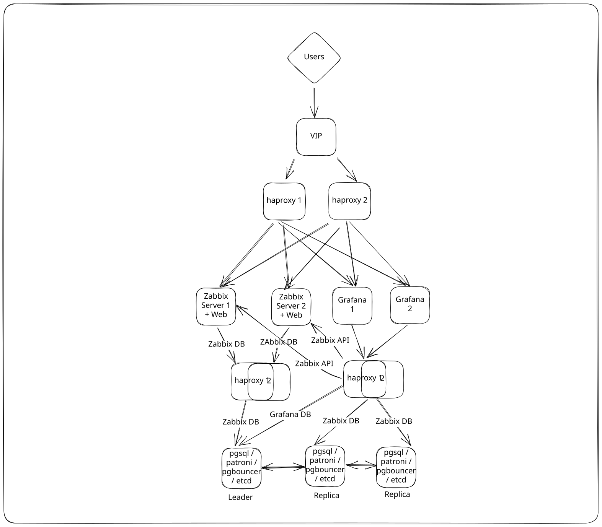
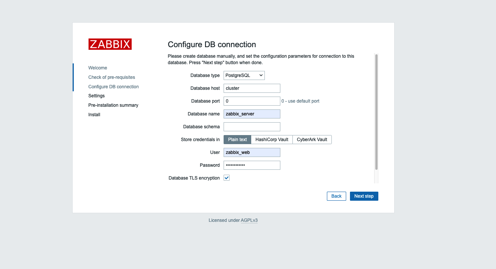
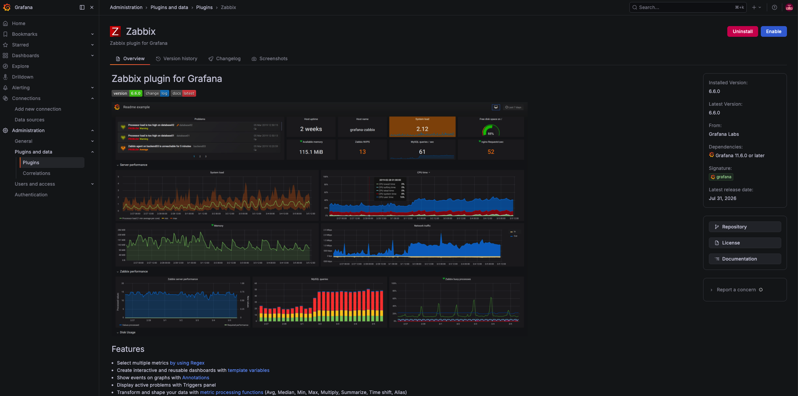
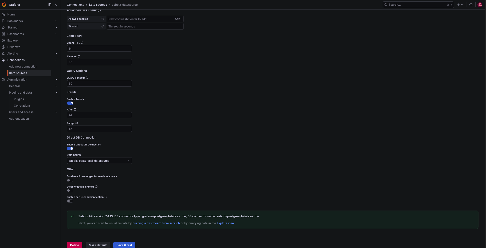

# Обзор Zabbix Demo
В этом демо настроим работу Zabbix-сервер в отказоустойчивой конфигурации с автоматическим переключением на резервный сервер PostgreSQL. А еще подключим Grafana в оптимальной конфигурации (с использованием DirectDB connection). Окружение тестировалось на серверах Ubuntu 24.04.

В репозитории вы найдете:
* документацию по установке и настройке компонентов
* примеры конфигурационных файлов
* процедуры тестирования отказоустойчивости


## Что будем использовать

| Компонент           | Назначение                  |
| ------------- | --------------------------- |
| PostgreSQL 18.4 | БД      |
| Patroni 4.1.3 | Оркестрация PostgreSQL |
| ETCD 3.4.30 | Распределенное хранилище состояния кластера|
|PGBouncer 1.25.2|Пулер соединений для PostgreSQL|
| Zabbix 7.4.13    | Мониторинг         |
|Nginx 1.24.0| Веб-сервер|
|PHP-FPM 8.3.6| Менеджер процессов PHP|
| HAProxy 2.8.16 | Балансировщик нагрузки     |
| Grafana 13.1.1 | Визуализация данных |
|Keepalived 2.2.8|Балансировщик нагрузки L4|


## Как будет выглядеть архитектура
Так будет выглядеть итоговая архитектура демо-инсталляции.


В инфраструктуре используются два сервера HAProxy и Keepalived для обеспечения высокой доступности сервисов.

Схема:

```text
haproxy01   192.168.0.2
haproxy02   192.168.0.3

VIP         192.168.0.100

Public IP   185.161.66.194
FQDN        haproxy.gals.training
```

Keepalived обеспечивает автоматическое переключение виртуального IP-адреса `192.168.0.100` между двумя HAProxy-серверами, а HAProxy выполняет маршрутизацию и балансировку трафика между backend-сервисами.

В конфигурации используются два отдельных скрипта:

- [`setup-haproxy.sh`](configs/setup-haproxy.sh) — установка и настройка HAProxy;
- [`setup-keepalived.sh`](configs/setup-keepalived.sh) — установка и настройка Keepalived.

Описание принципа работы скриптов приведено ниже в документации.

## Где будем разворачивать
Для работы окружения нам понадобится 9 серверов.

| Компонент          | Количество | Имя сервера | IP адреса |
| --------------------- | ----- | --------------------- | --------------------- | 
| PostgreSQL      | 3     | pg01, pg02, pg03 | 192.168.0.20, 192.168.0.21, 192.168.0.22|
| Zabbix сервер   | 2     | zbx01, zbx02     | 192.168.0.10, 192.168.0.11|
| HAProxy         | 2     | haproxy          | 192.168.0.2, 192.168.0.3 | 
| Grafana         | 2     | grafana          | 192.168.0.4, 192.168.0.5 | 


## Последовательность действий

Установку и настройку будем выполнять в следующем порядке:

1. Настройка сетевого подключения и разрешения имен хостов.
2. Установка и настройка кластера ETCD.
3. Установка и настройка PostgreSQL 18.
4. Настройка управления кластером Patroni
5. Настройка репликации и отказоустойчивости PostgreSQL.
6. Проверка высокой доступности PostgreSQL
7. Установка и настройка PGBouncer.
8. Установка и настройка haproxy и keepalived
8. Установка и настройка Zabbix-серверов.
9. Настройка Zabbix HA.
10. Настройка балансировки нагрузки на стороне фронтенда HAProxy.
11. Проверка отказоустойчивости.


# Настройка Zabbix Demo

## Настройка сетевого подключения и разрешения имен хостов
На каждом сервере обновим ```/etc/hosts```, добавив записи.

```
cat << EOF >> /etc/hosts
192.168.0.2    haproxy01
192.168.0.3    haproxy02
192.168.0.4    grafana01
192.168.0.5    grafana02
192.168.0.10   zbx01
192.168.0.11   zbx02
192.168.0.20   pg01
192.168.0.21   pg02
192.168.0.22   pg03
192.168.0.100  cluster
EOF
```
## Установка компонентов БД: etcd, PostgreSQL, Patroni, TimescaleDB, PGBouncer
### Установка и настройка кластера ETCD

Установите компоненты etcd
```
apt update
apt install etcd-server etcd-client
```
Отредактируйте конфигурацию etcd на каждой ноде: pg01, pg02, pg03
```
nano /etc/default/etcd
```
На ноде pg01
```
cat << EOF >> /etc/default/etcd
ETCD_NAME="pg01"
ETCD_DATA_DIR="/var/lib/etcd"
ETCD_INITIAL_ADVERTISE_PEER_URLS="http://192.168.0.20:2380"
ETCD_LISTEN_PEER_URLS="http://192.168.0.20:2380"
ETCD_LISTEN_CLIENT_URLS="http://192.168.0.20:2379,http://127.0.0.1:2379"
ETCD_ADVERTISE_CLIENT_URLS="http://192.168.0.20:2379"
ETCD_INITIAL_CLUSTER="pg01=http://192.168.0.20:2380,pg02=http://192.168.0.21:2380,pg03=http://192.168.0.22:2380"
ETCD_INITIAL_CLUSTER_TOKEN="zabbix-etcd-cluster"
ETCD_INITIAL_CLUSTER_STATE="new"
EOF
```
На ноде pg02
```
cat << EOF >> /etc/default/etcd
TCD_NAME="pg02"
ETCD_DATA_DIR="/var/lib/etcd"
ETCD_INITIAL_ADVERTISE_PEER_URLS="http://192.168.0.21:2380"
ETCD_LISTEN_PEER_URLS="http://192.168.0.21:2380"
ETCD_LISTEN_CLIENT_URLS="http://192.168.0.21:2379,http://127.0.0.1:2379"
ETCD_ADVERTISE_CLIENT_URLS="http://192.168.0.21:2379"
ETCD_INITIAL_CLUSTER="pg01=http://192.168.0.20:2380,pg02=http://192.168.0.21:2380,pg03=http://192.168.0.22:2380"
ETCD_INITIAL_CLUSTER_TOKEN="zabbix-etcd-cluster"
ETCD_INITIAL_CLUSTER_STATE="new"
EOF
```
На ноде pg03
```
cat << EOF >> /etc/default/etcd
ETCD_NAME="pg03"
ETCD_DATA_DIR="/var/lib/etcd"
ETCD_INITIAL_ADVERTISE_PEER_URLS="http://192.168.0.22:2380"
ETCD_LISTEN_PEER_URLS="http://192.168.0.22:2380"
ETCD_LISTEN_CLIENT_URLS="http://192.168.0.22:2379,http://127.0.0.1:2379"
ETCD_ADVERTISE_CLIENT_URLS="http://192.168.0.22:2379"
ETCD_INITIAL_CLUSTER="pg01=http://192.168.0.20:2380,pg02=http://192.168.0.21:2380,pg03=http://192.168.0.22:2380"
ETCD_INITIAL_CLUSTER_TOKEN="zabbix-etcd-cluster"
ETCD_INITIAL_CLUSTER_STATE="new"
EOF
```
На каждой ноде добавьте etcd в автозагрузку и запустите его
```
systemctl enable --now etcd
```
Проверьте текущий статус etcd
```
etcdctl endpoint health --cluster=true
```
На этом установка etcd завершена.

### Установка PostgreSQL

Все действия, описанные в этом разделе, выполняются на 3 серверах БД: pg01, pg02, pg03.
Начнем с установки БД PostgreSQL. Добавим репозиторий.

Для Ubuntu 24.04 LTS наиболее правильный способ установки PostgreSQL 18.4 — использовать официальный репозиторий PostgreSQL Global Development Group (PGDG). Он содержит актуальные версии PostgreSQL.

Установитн нужные пакеты
```
apt install -y curl ca-certificates postgresql-common
```
Подключите официальный репозиторий PostgreSQL (скрипт автоматом определит версию Ubuntu, добавит репозиторий, импортирует GPG-ключ, выполнит `apt update`)
```
/usr/share/postgresql-common/pgdg/apt.postgresql.org.sh
```
Установите пакет БД
```
apt install -y postgresql-18
```
Проверьте установленную версию
```
psql --version
```
Так как для управления БД мы будем использовать Patroni, нужно остановить сервис СУБД, удалить его из автозагрузки и удалить созданный кластер.
```
systemctl disable postgresql --now
pg_dropcluster --stop 18 main
```
На этом установка БД завершена.
### Установка Patroni

Все действия, описанные в этом разделе, выполняются на 3 серверах БД: pg01, pg02, pg03.
Установите Patroni
```
apt install -y patroni
```
Отредактируйте конфигурацию Patroni
```
nano /etc/patroni/config.yml
```
На ноде pg01
```
scope: postgres-cluster
namespace: /service/
name: pg01

restapi:
  listen: 0.0.0.0:8008
  connect_address: 192.168.0.20:8008

etcd3:
  hosts:
    - 192.168.0.20:2379
    - 192.168.0.21:2379
    - 192.168.0.22:2379

bootstrap:
  dcs:
    ttl: 30
    loop_wait: 10
    retry_timeout: 10
    maximum_lag_on_failover: 1048576

    postgresql:
      use_pg_rewind: true
      use_slots: true
      parameters:
        wal_level: replica
        hot_standby: "on"
        max_connections: 200
        max_wal_senders: 10
        max_replication_slots: 10
        wal_keep_size: 512MB
        shared_buffers: 1GB

  initdb:
    - encoding: UTF8
    - data-checksums

  pg_hba:
    - host all all 0.0.0.0/0 md5
    - host replication replicator 192.168.0.0/24 md5

  users:
    admin:
      password: 2tdxZ898D9MR
      options:
        - createrole
        - createdb

postgresql:
  listen: 0.0.0.0:5432
  connect_address: 192.168.0.20:5432
  data_dir: /var/lib/postgresql/18/main
  bin_dir: /usr/lib/postgresql/18/bin

  authentication:
    superuser:
      username: postgres
      password: 2tdxZ898D9MR
    replication:
      username: replicator
      password: 2tdxZ898D9MR

  parameters:
    unix_socket_directories: /var/run/postgresql

tags:
  nofailover: false
  noloadbalance: false
  clonefrom: false
  nosync: false
```
На ноде pg02
```
scope: postgres-cluster
namespace: /service/
name: pg02

restapi:
  listen: 0.0.0.0:8008
  connect_address: 192.168.0.21:8008

etcd3:
  hosts:
    - 192.168.0.20:2379
    - 192.168.0.21:2379
    - 192.168.0.22:2379

bootstrap:
  dcs:
    ttl: 30
    loop_wait: 10
    retry_timeout: 10
    maximum_lag_on_failover: 1048576

    postgresql:
      use_pg_rewind: true
      use_slots: true
      parameters:
        wal_level: replica
        hot_standby: "on"
        max_connections: 200
        max_wal_senders: 10
        max_replication_slots: 10
        wal_keep_size: 512MB
        shared_buffers: 1GB

  initdb:
    - encoding: UTF8
    - data-checksums

  pg_hba:
    - host all all 0.0.0.0/0 md5
    - host replication replicator 192.168.0.0/24 md5

  users:
    admin:
      password: 2tdxZ898D9MR
      options:
        - createrole
        - createdb

postgresql:
  listen: 0.0.0.0:5432
  connect_address: 192.168.0.21:5432
  data_dir: /var/lib/postgresql/18/main
  bin_dir: /usr/lib/postgresql/18/bin

  authentication:
    superuser:
      username: postgres
      password: 2tdxZ898D9MR
    replication:
      username: replicator
      password: 2tdxZ898D9MR

  parameters:
    unix_socket_directories: /var/run/postgresql

tags:
  nofailover: false
  noloadbalance: false
  clonefrom: false
  nosync: false
```
На ноде pg03
```
scope: postgres-cluster
namespace: /service/
name: pg03

restapi:
  listen: 0.0.0.0:8008
  connect_address: 192.168.0.22:8008

etcd3:
  hosts:
    - 192.168.0.20:2379
    - 192.168.0.21:2379
    - 192.168.0.22:2379

bootstrap:
  dcs:
    ttl: 30
    loop_wait: 10
    retry_timeout: 10
    maximum_lag_on_failover: 1048576

    postgresql:
      use_pg_rewind: true
      use_slots: true
      parameters:
        wal_level: replica
        hot_standby: "on"
        max_connections: 200
        max_wal_senders: 10
        max_replication_slots: 10
        wal_keep_size: 512MB
        shared_buffers: 1GB

  initdb:
    - encoding: UTF8
    - data-checksums

  pg_hba:
    - host all all 0.0.0.0/0 md5
    - host replication replicator 192.168.0.0/24 md5

  users:
    admin:
      password: 2tdxZ898D9MR
      options:
        - createrole
        - createdb

postgresql:
  listen: 0.0.0.0:5432
  connect_address: 192.168.0.22:5432
  data_dir: /var/lib/postgresql/18/main
  bin_dir: /usr/lib/postgresql/18/bin

  authentication:
    superuser:
      username: postgres
      password: 2tdxZ898D9MR
    replication:
      username: replicator
      password: 2tdxZ898D9MR

  parameters:
    unix_socket_directories: /var/run/postgresql

tags:
  nofailover: false
  noloadbalance: false
  clonefrom: false
  nosync: false
```
Перезагрузите Patroni
```
systemctl enable patroni --now
```
Убедитесь, что Patroni видит все ноды. В ответе вы должны увидеть 3 ноды кластера.
```
patronictl -c /etc/patroni/config.yml list
```
На этом установка Patroni завершена.
### Установка TimescaleDB
Добавьте репозиторий TimescaleDB (выполните на 3 серверах БД: pg01, pg02, pg03)
```
curl -fsSL https://packagecloud.io/timescale/timescaledb/gpgkey | sudo gpg --dearmor -o /usr/share/keyrings/timescaledb-archive-keyring.gpg
echo "deb [signed-by=/usr/share/keyrings/timescaledb-archive-keyring.gpg] \
https://packagecloud.io/timescale/timescaledb/ubuntu/ noble main" | sudo tee /etc/apt/sources.list.d/timescaledb.list
apt update
apt install -y timescaledb-2-postgresql-18
```
Так как управление кластером происходит через Patroni, необходимо подключить расширение TimescaleDB. Отредактируйте конфигурацию Patroni и добавьте расширение TimescaleDB
```
patronictl -c /etc/patroni/config.yml edit-config
```
Нужно встроить в файл следующую конструкцию
```
postgresql:
  parameters:
    shared_preload_libraries: timescaledb
```
После этого перезагрузить последовательно ноды PostgreSQL. Начните с реплик и закончите лидером.
```
patronictl -c /etc/patroni/config.yml restart postgres-cluster pg02
patronictl -c /etc/patroni/config.yml restart postgres-cluster pg03
patronictl -c /etc/patroni/config.yml restart postgres-cluster pg01
```
После перезагрузки убедитесь, что расширение загрузилось
```
sudo -u postgres psql -h 127.0.0.1 -p 5432 -d postgres
SHOW shared_preload_libraries;
```


### Установка PGBouncer
Установите PGBouncer (выполните на 3 серверах БД: pg01, pg02, pg03), добавьте его в автозагрузку и остановите
```
apt install -y pgbouncer
systemctl enable pgbouncer
systemctl stop pgbouncer
```

Создайте необходимые роли Zabbix и базы данных. Необходимо создать 2 базы (zabbix_server и grafana), а также 4 роли:
`zabbix_srv` будет использоваться для подключения Zabbix Server к БД Zabbix
`zabbix_web` будет использоваться для подключения Zabbix Frontend к БД Zabbix. Создайте отдельного пользователя Zabbix Frontend для упрощения диагностики работы БД в будущем.
`grafana_zabbix` будет использоваться для подключения Grafana к БД Zabbix
`grafana` будет использоваться для подключения Grafana к БД Grafana
```
PGPASSWORD='2tdxZ898D9MR' \
psql \
  -h 127.0.0.1 \
  -p 5432 \
  -U postgres

CREATE ROLE zabbix_srv LOGIN PASSWORD '2tdxZ898D9MR';
CREATE ROLE zabbix_web LOGIN PASSWORD '2tdxZ898D9MR';
CREATE ROLE grafana_zabbix LOGIN PASSWORD '2tdxZ898D9MR';
CREATE ROLE grafana LOGIN PASSWORD '2tdxZ898D9MR';
CREATE DATABASE zabbix_server OWNER zabbix_srv;
CREATE DATABASE grafana OWNER 'grafana';
```
Получиnt SCRAM-секреты пользователей (понадобятся для работы PGBouncer)
SELECT rolname || '|' || rolpassword FROM pg_authid WHERE rolname IN ('postgres', 'zabbix_srv', 'zabbix_web', 'grafana', 'grafana_zabbix');

Добавьте записи в конфигурационный файл /etc/pgbouncer/userlist.txt (выполните на 3 серверах БД: pg01, pg02, pg03). В вашем случае хэши паролей будут отличаться.
```
nano /etc/pgbouncer/userlist.txt
"postgres" "SCRAM-SHA-256$4096:vOLwdJq2iQlAErxB/tmr3Q==$aGsEz/IDYGMWpircIyLuXJ5iZSKZqv1eFRQW7rgA2FA=:Gh+NhWMdjFPlgjo94WcB8bamojLi3vN4Jyf/RG10MKU="
"zabbix_srv" "SCRAM-SHA-256$4096:Dt2pydTlGUvc9CckB8EGBw==$d6z6YYLy+A8B3bdxucXDVpg85gl84tIJehhIyHuVvwg=:R9NctBV2LcaXql3PsNDp3YuFjDVX2KftF9C2IENK3uE="
"zabbix_web" "SCRAM-SHA-256$4096:AR8hHO9nLBjrZitlANy8IQ==$0qABD5ghyOyc8dmMZblvVV+SC22FNJsHkqP42y+I2dw=:MhL0utZXPhspp+QjsOoSyDfSlkaXM4vRkg31Zz5VCxA="
"grafana_zabbix" "SCRAM-SHA-256$4096:vOLwdJq2iQlAErxB/tmr3Q==$aGsEz/IDYGMWpircIyLuXJ5iZSKZqv1eFRQW7rgA2FA=:Gh+NhWMdjFPlgjo94WcB8bamojLi3vN4Jyf/RG10MKU="
"grafana" "SCRAM-SHA-256$4096:kHvnLIdYr4iXTNNpvxlOxQ==$T9fv3QwJEgpHf5geLicCJX5CO+lln/7AC29ev8GinKU=:xSoqpjhYH/nkHuvWH7R5cSHFaE29HOL3ekwLEB6pAg0="
```
Установите права на конфигурационный файл (выполните на 3 серверах БД: pg01, pg02, pg03)
```
chown postgres:postgres /etc/pgbouncer/userlist.txt
chmod 600 /etc/pgbouncer/userlist.txt
```

Модифицируйте файл /etc/pgbouncer/pgbouncer.ini (выполните на 3 серверах БД: pg01, pg02, pg03), добавив/изменив значения в соответствующих секциях
```
nano /etc/pgbouncer/pgbouncer.ini
[databases]
zabbix_server = host=127.0.0.1 port=5432 dbname=zabbix_server
grafana = host=127.0.0.1 port=5432 dbname=grafana pool_mode=session
[pgbouncer]
listen_addr = 0.0.0.0
auth_type = scram-sha-256
pool_mode = transaction
max_client_conn = 500
default_pool_size = 100
```
 
Перезагрузите PGBouncer (выполните на 3 серверах БД: pg01, pg02, pg03)
```
systemctl restart pgbouncer
```
Проверьте подключение (выполните на 3 серверах БД: pg01, pg02, pg03)
```
PGPASSWORD='2tdxZ898D9MR' \
psql \
  -h 127.0.0.1 \
  -p 6432 \
  -U zabbix_srv \
  -d zabbix_server \
  -c "SELECT current_user, pg_is_in_recovery();"
```
На репликах в столбце pg_is_in_recovery получите t, а на лидере f.

## Настройка балансировки нагрузки (HAProxy + Keepalived)

В этом разделе описаны принципы работы скриптов-установщиков и порядок действий для установки компонентов.

### Установка HAProxy
Выполните установку HAProxy на обоих нодах haproxy: haproxy01 и haproxy02 при помощи скрипта [`setup-haproxy.sh`](configs/setup-haproxy.sh).


<details>
<summary>Детальное описание принципов работы скрипта</summary>


Скрипт `setup-haproxy.sh` предназначен для автоматизированной установки и настройки HAProxy на серверах:

```text
haproxy01 — 192.168.0.2
haproxy02 — 192.168.0.3
```

Один и тот же скрипт может запускаться на обеих нодах. Скрипт автоматически определяет текущий сервер по его IP-адресу и применяет соответствующие параметры.

HAProxy используется как единая точка доступа к следующим сервисам:

```text
Zabbix
Grafana
PostgreSQL / Patroni
```

#### Устанавливаемые компоненты

Скрипт устанавливает необходимые пакеты:

```text
haproxy
certbot
ca-certificates
curl
dnsutils
openssl
openssh-client
```

Установка выполняется в неинтерактивном режиме.

Для предотвращения перезаписи локально изменённых конфигурационных файлов, например:

```text
/etc/ssh/sshd_config
```

используются параметры:

```text
--force-confdef
--force-confold
```

Таким образом, существующие настройки SSH сохраняются.


#### Определение HAProxy-ноды

Скрипт автоматически определяет, на каком сервере он выполняется.

Для `haproxy01`:

```text
IP:       192.168.0.2
Hostname: haproxy01
Peer:     haproxy02
```

Для `haproxy02`:

```text
IP:       192.168.0.3
Hostname: haproxy02
Peer:     haproxy01
```

Определение выполняется по локальному IP-адресу интерфейса.


#### Работа с виртуальным IP

Для PostgreSQL HAProxy слушает виртуальный адрес Keepalived:

```text
192.168.0.100
```

Так как на BACKUP-сервере данный IP физически отсутствует до момента failover, скрипт включает системный параметр:

```text
net.ipv4.ip_nonlocal_bind = 1
```

Это позволяет HAProxy запускаться и заранее создавать listener'ы для VIP даже на резервной ноде.

Настройка сохраняется в:

```text
/etc/sysctl.d/99-haproxy.conf
```

#### HTTPS и сертификат Let's Encrypt

Для веб-интерфейсов используется FQDN (измените его на свой):

```text
haproxy.gals.training
```
Пример:

```text
haproxy.gals.training → 185.185.185.185
```

Публичный адрес должен быть NAT'ирован на Keepalived VIP:

```text
185.185.185.185:80
    ↓
192.168.0.100:80

185.185.185.185:443
    ↓
192.168.0.100:443
```


#### Получение сертификата

Получением и автоматическим продлением сертификата занимается только:

```text
haproxy01
```

Перед запросом сертификата скрипт проверяет наличие DNS-записи и соответствие IP:

```text
haproxy.gals.training → 185.185.185.185
```

Если DNS-запись отсутствует или указывает на другой IP, выполнение останавливается.


#### HTTP-01 challenge

Certbot используется в режиме:

```text
standalone
```

и локально слушает:

```text
192.168.0.2:8888
```

При этом Let's Encrypt обращается к серверу через стандартный HTTP-порт:

```text
haproxy.gals.training:80
```

HAProxy перехватывает запросы:

```text
/.well-known/acme-challenge/
```

и перенаправляет их на:

```text
haproxy01:8888
```

Схема:

```text
Let's Encrypt
      |
      | HTTP :80
      v
185.185.185.185
      |
      v
192.168.0.100
      |
      v
HAProxy MASTER
      |
      | /.well-known/acme-challenge/
      v
haproxy01:8888
      |
      v
Certbot
```

Преимущество такого подхода заключается в том, что HAProxy не требуется останавливать во время продления сертификата.


#### Временный сертификат

Для первичного запуска HAProxy скрипт автоматически создаёт временный self-signed сертификат.

Он необходим потому, что HAProxy проверяет наличие SSL-сертификата уже при запуске конфигурации.

После успешного получения сертификата Let's Encrypt временный сертификат заменяется на действующий.

Файл HAProxy PEM:

```text
/etc/haproxy/certs/haproxy.gals.training.pem
```

Он содержит:

```text
fullchain.pem
+
privkey.pem
```


#### Синхронизация сертификата между HAProxy

После получения или обновления сертификата на `haproxy01` он автоматически копируется на:

```text
haproxy02
```

Передача выполняется по SSH/SCP:

```text
haproxy01 → haproxy02
```

Используется существующая авторизация по SSH-ключу.

Скрипт самостоятельно SSH-ключи не создаёт.

#### Работа с known_hosts

Для автоматической обработки первого SSH-подключения используется:

```text
StrictHostKeyChecking=accept-new
```

Это означает:

- новый SSH host key автоматически добавляется в `/root/.ssh/known_hosts`;
- интерактивный запрос подтверждения не появляется;
- если ключ уже известного сервера неожиданно изменился, SSH завершит соединение с ошибкой.

Таким образом, скрипт может выполняться полностью автоматически без использования небезопасного `StrictHostKeyChecking=no`.


#### Автоматическое продление сертификата

На `haproxy01` включается:

```text
certbot.timer
```

На `haproxy02` автоматический Certbot отключается.

После успешного renewal запускается deploy hook:

```text
/etc/letsencrypt/renewal-hooks/deploy/haproxy.sh
```

Hook выполняет:

```text
1. Формирование нового HAProxy PEM
2. Проверку конфигурации HAProxy
3. Reload HAProxy на haproxy01
4. Копирование сертификата на haproxy02
5. Проверку HAProxy на haproxy02
6. Reload HAProxy на haproxy02
```

Таким образом, на обеих HAProxy-нодах всегда используется один и тот же сертификат.


#### Балансировка Zabbix

HAProxy балансирует HTTP-трафик между двумя Zabbix frontend:

```text
zbx01 — 192.168.0.10:80
zbx02 — 192.168.0.11:80
```

Используется алгоритм:

```text
roundrobin
```

Внешний URL:

```text
https://haproxy.gals.training/zabbix/
```

Путь:

```text
/zabbix/
```

удаляется перед передачей на backend.

Например:

```text
https://haproxy.gals.training/zabbix/index.php
```

преобразуется в:

```text
http://zbx01/index.php
```

или:

```text
http://zbx02/index.php
```

Для backend'ов передаются заголовки:

```text
X-Forwarded-Prefix: /zabbix
X-Forwarded-Proto: https
```

#### Health check Zabbix

HAProxy выполняет HTTP-проверку:

```text
GET /
```

Ожидаемый код ответа:

```text
200
```

Если Zabbix frontend несколько раз подряд не проходит проверку, он временно исключается из балансировки.

После восстановления сервер автоматически возвращается в пул.


#### Балансировка Grafana

Используются две Grafana-ноды:

```text
grafana01 — 192.168.0.4:3000
grafana02 — 192.168.0.5:3000
```

Алгоритм балансировки:

```text
roundrobin
```

Внешний URL:

```text
https://haproxy.gals.training/grafana/
```

Для проверки работоспособности Grafana используется:

```text
GET /api/health
```

Ожидаемый HTTP-код:

```text
200
```

При недоступности одной Grafana весь трафик автоматически направляется на оставшуюся рабочую ноду.


#### Балансировка PostgreSQL / Patroni

HAProxy предоставляет два отдельных endpoint'а для PostgreSQL.

##### Primary

```text
192.168.0.100:5432
```

Предназначен для подключения к текущему PostgreSQL Primary.

HAProxy проверяет Patroni REST API:

```text
GET /primary
```

на порту:

```text
8008
```

Если узел является текущим Primary, Patroni возвращает успешный ответ и HAProxy направляет PostgreSQL-соединения на его PgBouncer:

```text
6432
```

Backend'ы:

```text
pg01 — 192.168.0.20:6432
pg02 — 192.168.0.21:6432
pg03 — 192.168.0.22:6432
```

##### Replicas

Для read-only соединений используется:

```text
192.168.0.100:5433
```

HAProxy проверяет:

```text
GET /replica
```

и балансирует подключения между доступными PostgreSQL replica.

Алгоритм:

```text
roundrobin
```


#### HAProxy Statistics

Локально на каждой HAProxy-ноде включён web-интерфейс статистики:

```text
http://127.0.0.1:7000/
```

Он используется как для диагностики HAProxy, так и для health-check со стороны Keepalived.

Текущая Basic Authentication:

```text
admin:admin
```

В production рекомендуется заменить пароль.


#### Проверка конфигурации HAProxy

Перед применением конфигурации выполняется:

```bash
haproxy -c -f /etc/haproxy/haproxy.cfg
```

Если обнаружена синтаксическая ошибка, скрипт прекращает выполнение.

Перед изменением существующего файла создаётся резервная копия:

```text
/etc/haproxy/haproxy.cfg.bak.<date-time>
```

</details>

### Установка Keepalived

Выполните установку Keepalived на обоих нодах haproxy: haproxy01 и haproxy02 при помощи скрипта [`setup-keepalived.sh`](configs/setup-keepalived.sh).

<details>
<summary>Детальное описание принципов работы скрипта</summary>

Скрипт `setup-keepalived.sh` предназначен для создания отказоустойчивой пары HAProxy-серверов.

Keepalived управляет виртуальным IP:

```text
192.168.0.100
```

VIP в каждый момент времени принадлежит только одному из двух серверов.

Основная схема:

```text
                192.168.0.100
                      VIP
                       |
              +--------+--------+
              |                 |
         haproxy01          haproxy02
         192.168.0.2        192.168.0.3
         priority 150       priority 100
              |
            MASTER
```

В нормальном состоянии владельцем VIP является:

```text
haproxy01
```

При его отказе VIP автоматически переходит на:

```text
haproxy02
```


#### Автоматическое определение ноды

Один и тот же Keepalived-скрипт запускается на обеих нодах.

На `haproxy01` автоматически устанавливаются:

```text
state MASTER
priority 150
peer 192.168.0.3
```

На `haproxy02`:

```text
state BACKUP
priority 100
peer 192.168.0.2
```

Сетевой интерфейс также определяется автоматически по IP текущего сервера.

Например:

```text
192.168.0.2 → ens18
```


#### VRRP

Для передачи состояния между HAProxy-серверами используется VRRP.

Конфигурация работает в режиме:

```text
unicast
```

То есть вместо multicast ноды напрямую обмениваются VRRP-сообщениями:

```text
192.168.0.2 ↔ 192.168.0.3
```

Настройка включает:

```text
unicast_src_ip
unicast_peer
```

Такой режим удобен в виртуальных и облачных сетях, где multicast может быть недоступен или нежелателен.


#### VRRP priority

Используются следующие значения:

```text
haproxy01 = 150
haproxy02 = 100
```

Поэтому при нормальной работе предпочтительным MASTER является:

```text
haproxy01
```

После восстановления `haproxy01` он снова имеет более высокий priority и может вернуть VIP себе.

#### Health check HAProxy

Keepalived не только проверяет существование процесса HAProxy, но и проверяет его реальную HTTP-доступность.

Создаётся скрипт:

```text
/usr/local/bin/check-haproxy.sh
```

Сначала выполняется проверка:

```bash
systemctl is-active haproxy
```

После этого проверяется HAProxy Statistics endpoint:

```text
http://127.0.0.1:7000/
```

с Basic Authentication.

Таким образом, ситуация, когда процесс HAProxy существует, но сам сервис фактически не отвечает, также считается отказом.


#### Параметры проверки HAProxy

Keepalived выполняет health check каждые:

```text
2 секунды
```

Используются:

```text
fall 3
rise 2
```

Это означает:

```text
3 последовательные ошибки
→ HAProxy считается неисправным

2 последовательные успешные проверки
→ HAProxy снова считается рабочим
```

#### Переключение VIP при отказе

Если HAProxy на текущем MASTER перестаёт проходить health check, Keepalived переводит соответствующий VRRP instance в аварийное состояние.

VIP:

```text
192.168.0.100
```

переходит на второй сервер.

Например:

```text
До отказа:

192.168.0.100
      |
      v
haproxy01


После отказа haproxy01:

192.168.0.100
      |
      v
haproxy02
```

Для клиентов адрес подключения при этом не меняется.

#### Восстановление после отказа

После восстановления HAProxy:

```bash
systemctl start haproxy
```

health check снова начинает проходить.

Так как `haproxy01` имеет более высокий priority:

```text
150 > 100
```

VIP может вернуться обратно на `haproxy01`.

#### Проверка конфигурации Keepalived

Скрипт определяет, какой вариант проверки синтаксиса поддерживается установленной версией Keepalived.

В первую очередь используется:

```bash
keepalived --config-test
```

Если эта команда недоступна, проверяется возможность использования:

```bash
keepalived -t
```

Если отдельная функция проверки отсутствует, конфигурация валидируется непосредственно при запуске службы.

Стандартный конфигурационный файл:

```text
/etc/keepalived/keepalived.conf
```

#### Резервное копирование конфигурации Keepalived

Перед изменением существующего файла создаётся копия:

```text
/etc/keepalived/keepalived.conf.bak.<date-time>
```

Это позволяет быстро восстановить предыдущую конфигурацию.

#### Итоговая схема отказоустойчивости

После настройки обоих скриптов инфраструктура выглядит следующим образом:

```text
                         Internet
                            |
                            v
                    185.161.66.194
                            |
                           NAT
                            |
                            v
                    192.168.0.100
                      Keepalived VIP
                            |
                 +----------+----------+
                 |                     |
                 v                     v
             haproxy01             haproxy02
             192.168.0.2           192.168.0.3
             priority 150          priority 100
                 |
              HAProxy
                 |
      +----------+----------+-------------+
      |                     |             |
      v                     v             v
   Zabbix                 Grafana      PostgreSQL
   zbx01                  grafana01      Patroni
   zbx02                  grafana02
```

#### Роли компонентов

Ответственность между компонентами разделена следующим образом:

```text
Keepalived
    |
    +-- управление VIP
    +-- выбор активного HAProxy
    +-- контроль состояния HAProxy
    +-- automatic failover

HAProxy
    |
    +-- TLS termination
    +-- Let's Encrypt HTTP-01 routing
    +-- HTTP routing
    +-- балансировка Zabbix
    +-- балансировка Grafana
    +-- определение PostgreSQL Primary
    +-- балансировка PostgreSQL Replica

Certbot
    |
    +-- выпуск TLS-сертификата
    +-- автоматическое продление
    +-- deploy hook
    +-- синхронизация сертификата между HAProxy
```

В результате отказ одной HAProxy-ноды не приводит к изменению адресов подключения клиентов и не требует ручного переключения трафика.
</details>

### Установка Zabbix Server, Zabbix Frontend

Установите клиент PostgreSQL и утилиту curl на обоих серверах Zabbix (zbx01, zbx02). Они нам пригодятся при дальнейшем тестировании подключения.
```
apt update
apt install -y curl postgresql-common
/usr/share/postgresql-common/pgdg/apt.postgresql.org.sh
apt install -y postgresql-client-18
```
Добавьте репозиторий Zabbix (выполните на zbx01, zbx02)
```
wget https://repo.zabbix.com/zabbix/7.4/release/ubuntu/pool/main/z/zabbix-release/zabbix-release_latest+ubuntu24.04_all.deb
dpkg -i zabbix-release_latest+ubuntu24.04_all.deb
apt update
```
Установите компоненты Zabbix
```
apt install -y \
  zabbix-server-pgsql \
  zabbix-frontend-php \
  zabbix-nginx-conf \
  zabbix-sql-scripts \
  zabbix-agent2 \
  php8.3-pgsql
```
Первичное создание базы и импорт лучше выполнять напрямую через порт PostgreSQL 5432 текущего Leader, а не через PgBouncer. Это исключает влияние пула и смену backend во время длительного импорта. Проверьте кто сейчас является лидером
```
patronictl -c /etc/patroni/config.yml list
```
Проверьте прямое подключение к БД через haproxy с обоих Zabbix-серверов
```
PGPASSWORD='2tdxZ898D9MR' \
psql \
  -h "cluster" \
  -p 5432 \
  -U zabbix_srv \
  -d zabbix_server \
  -c "SELECT current_user, current_database(), pg_is_in_recovery();"
```
Импортируйте основную схему Zabbix
```
zcat /usr/share/zabbix/sql-scripts/postgresql/server.sql.gz \
| PGPASSWORD='2tdxZ898D9MR' \
  psql \
    -h "cluster" \
    -p 5432 \
    -U zabbix_srv \
    -d zabbix_server \
    -v ON_ERROR_STOP=1
```
Убедитесь, что схема была создана:
```
PGPASSWORD='2tdxZ898D9MR' \
psql \
  -h "cluster" \
  -U zabbix_srv \
  -d zabbix_server

\dt
```
Должно быть 207 таблиц. Для выхода нажмите `q`, а затем введите `\q`.

Создайте расширение TimescaleDB на Leader:
```
PGPASSWORD='2tdxZ898D9MR' \
psql \
  -h cluster \
  -d zabbix_server \
  -v ON_ERROR_STOP=1 \
  -U zabbix_srv \
  -c "CREATE EXTENSION IF NOT EXISTS timescaledb CASCADE;"
```

Настройте Zabbix на использование гипертаблиц. Скрипт timescaledb/schema.sql создает hypertable и настраивает параметры housekeeping и сжатия. Предупреждения TimescaleDB 2.9+ о несоблюдении некоторых best practices при выполнении этого скрипта можно игнорировать — Zabbix указывает, что настройка при этом завершается успешно.
```
PGPASSWORD='2tdxZ898D9MR' \
psql \
  -h "cluster" \
  -p 5432 \
  -U zabbix_srv \
  -d zabbix_server \
  -v ON_ERROR_STOP=1 \
  -f /usr/share/zabbix/sql-scripts/postgresql/timescaledb/schema.sql
```
Убедитесь, что гипертаблицы были созданы
```
PGPASSWORD='2tdxZ898D9MR' \
psql \
  -h "cluster" \
  -U zabbix_srv \
  -d zabbix_server \
  -c "
SELECT hypertable_schema,
       hypertable_name,
       num_dimensions
FROM timescaledb_information.hypertables
ORDER BY hypertable_name;
"
```
Выдайте права учетной записи `zabbix_web` на все созданные таблицы
```
PGPASSWORD='2tdxZ898D9MR' \
psql \
  -h "cluster" \
  -U postgres \
  -d zabbix_server

GRANT CONNECT ON DATABASE zabbix_server TO zabbix_web;
GRANT USAGE ON SCHEMA public TO zabbix_web;
GRANT ALL ON ALL TABLES IN SCHEMA public TO zabbix_web;
GRANT ALL ON ALL SEQUENCES IN SCHEMA public TO zabbix_web;
GRANT ALL ON ALL FUNCTIONS IN SCHEMA public TO zabbix_web;
GRANT ALL ON ALL PROCEDURES IN SCHEMA public TO zabbix_web;
```
Выдайте права на чтение исторических таблиц для `grafana_zabbix`
```
PGPASSWORD='2tdxZ898D9MR' \
psql \
  -h "cluster" \
  -U postgres \
  -d zabbix_server

GRANT CONNECT ON DATABASE zabbix_server TO grafana_zabbix;
GRANT USAGE ON SCHEMA public TO grafana_zabbix;
GRANT SELECT ON TABLE history TO grafana_zabbix;
GRANT SELECT ON TABLE history_uint TO grafana_zabbix;
GRANT SELECT ON TABLE history_str TO grafana_zabbix;
GRANT SELECT ON TABLE history_text TO grafana_zabbix;
GRANT SELECT ON TABLE history_log TO grafana_zabbix;
GRANT SELECT ON TABLE trends TO grafana_zabbix;
GRANT SELECT ON TABLE trends_uint TO grafana_zabbix;
```
Настройте конфигурацию Zabbix сервер на обоих нодах
```
cat << EOF >> /etc/zabbix/zabbix_server.conf
DBHost=cluster
DBName=zabbix_server
DBUser=zabbix_srv
DBPassword=2tdxZ898D9MR
EOF
```
На ноде zbx01 дополнительно настройте
```
cat << EOF >> /etc/zabbix/zabbix_server.conf
HANodeName=zbx01
NodeAddress=192.168.0.10:10051
EOF
```
На ноде zbx02 дополнительно настройте
```
cat << EOF >> /etc/zabbix/zabbix_server.conf
HANodeName=zbx02
NodeAddress=192.168.0.11:10051
EOF
```
Добавьте в загрузку сервисы и запустите их
```
systemctl enable php8.3-fpm nginx zabbix-server zabbix-agent2 --now
```


#### Настройка Nginx
На нодах zbx01 и zbx02 проверьте настройки Nginx на предмет сайтов по умолчанию
```
grep -R "listen .*80" \
  /etc/nginx/nginx.conf \
  /etc/nginx/sites-enabled \
  /etc/nginx/conf.d \
  /etc/zabbix 2>/dev/null
```
При необходимости, удалите сайт по умолчанию:
```
rm -f /etc/nginx/sites-enabled/default
```
Отредактируйте конфигурацию Zabbix
```
nano /etc/nginx/conf.d/zabbix.conf
    listen          80;
    server_name     _;
```
#### Настройка Zabbix Frontend
Выполните первичную конфигурацию веб-интерфейса, открыв веб-интерфейс Zabbix непосредственно на одной из нод. С кластерного адреса данная настройка недоступна.

В результате этой настройки вы получите созданный конфигурационный файл /usr/share/zabbix/ui/conf/zabbix.conf.php, который нужно скопировать на другую ноду Zabbix.

### Установка Grafana 
Все описанные действия необходимо выполнить на серверах Grafana: grafana01, grafana02

Подготовьте серверы
```
apt update
apt upgrade -y
apt install -y \
  -o Dpkg::Options::="--force-confdef" \
  -o Dpkg::Options::="--force-confold" \
  apt-transport-https \
  ca-certificates \
  wget \
  gnupg
```
Добавьте репозиторий, добавьте Grafana в автозагрузку и установите плагин Zabbix
```
apt-get install -y adduser libfontconfig1 musl
wget https://dl.grafana.com/grafana/release/13.1.1/grafana_13.1.1_29761037902_linux_amd64.deb
dpkg -i grafana_13.1.1_29761037902_linux_amd64.deb
systemctl daemon-reload
systemctl enable grafana-server
grafana cli plugins install alexanderzobnin-zabbix-app
```
Настройте Grafana. Выполните на обоих се
```
nano /etc/grafana/grafana.ini
[server]
root_url = https://haproxy.gals.training/grafana
serve_from_sub_path = true
[database]
type = postgres
host = cluster:5432
name = grafana
user = grafana
password = 2tdxZ898D9MR
```
Добавьте в автозагрузку и запустите Grafana
```
systemctl enable grafana-server --now
```
Убедитесь, что на обоих серверах Grafana запустилась:
```
systemctl status grafana-server
```
Теперь можно залогиниться в интерфейс Grafana. Перейдите по URL https://haproxy.gals.training/grafana и введите учетные данные по умолчанию admin/admin. При первом входе система предложит их заменить.

Перейдите в раздел Connections → Datasources и добавьте новый источник данных типа PostgreSQL. Обратите внимание, что порт подключения здесь указан 5433, что означает подключение к репликам БД.


Перейдите в раздел Administration → Plugins and data → Plugins, найдите и включите плагин Zabbix


zabbix-plugin-enable.png Перейдите в раздел Connections → Datasources и добавьте новый источник данных типа Zabbix.


Далее настройте плагин. Укажите реквизиты подключения к Zabbix


Дополнительно настройте Direct DB Connection



