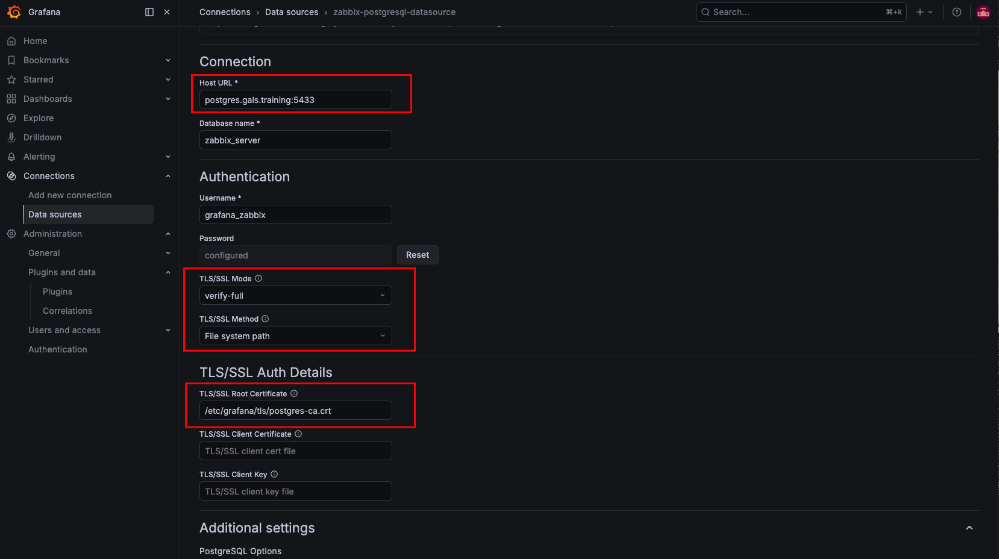
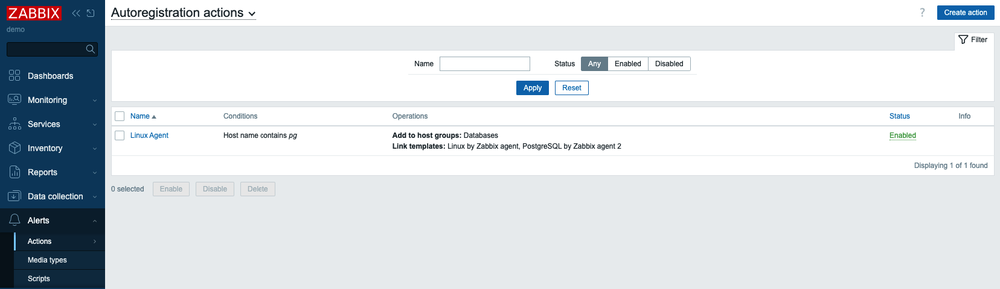
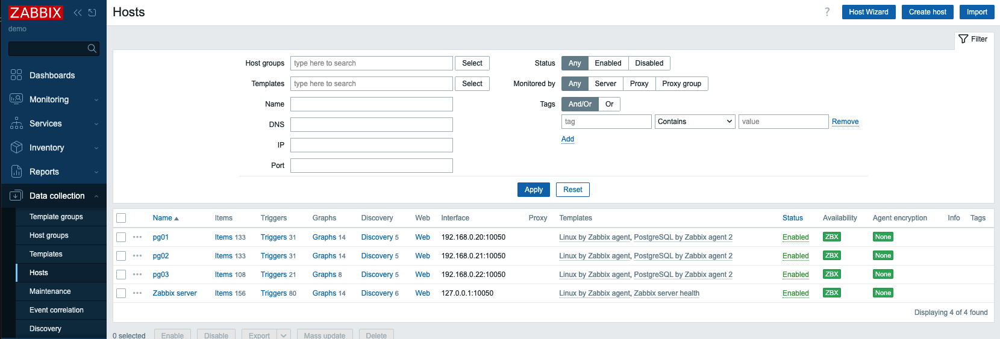
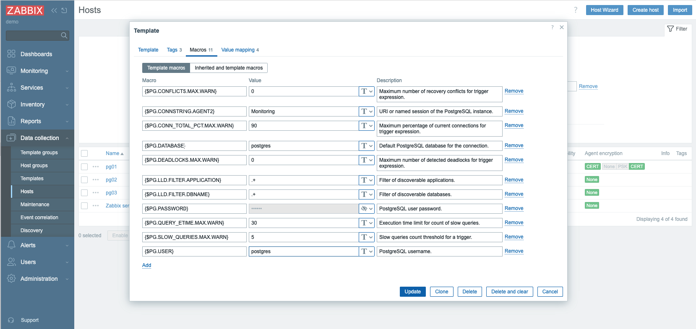
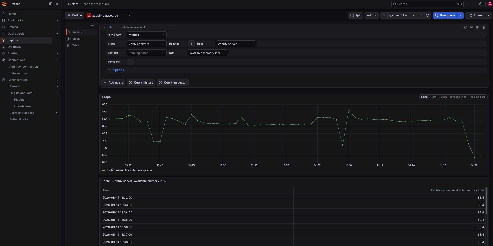

# Безопасный Zabbix Demo

Это продолжение части, где мы [разворачивали отказоустойчивый Zabbix](zabbix-prod-non-secure-rus.md). Теперь мы сделаем так, чтобы **шифрование не заканчивалось на HAProxy**, а сохранялось до Grafana/Zabbix и PostgreSQL. Схема взаимодействия компонентов приведена ниже.

```text
Пользователь
    │
    │ HTTPS :443
    ▼
┌────────────────────┐
│ HAProxy VIP        │
│ haproxy.gals...    │
└─────────┬──────────┘
          │
          ├── HTTPS ──► grafana01
          │             grafana02
          │
          ├── HTTPS ──► zbx01 frontend
          │             zbx02 frontend
          │
          │
          └── TLS/TCP ─► PostgreSQL primary
                          pg01/pg02/pg03

Zabbix Server ── TLS verify-full ──► PostgreSQL
Grafana       ── TLS verify-full ──► PostgreSQL
Zabbix Web    ── TLS verify-full ──► PostgreSQL
```
Все настройки выполняются на базе ранее развернутого окружения


## Настройка разрешения имен хостов

Для подключения к БД с серверов grafana01/02 и zbx01/02 будем использовать verify-full, который проверяет и цепочку CA, и соответствие hostname сертификату. Следовательно, нам нужно общее имя для кластера. HAProxy будет работать в режиме TCP passthrough, поэтому TLS будет устанавливаться непосредственно между Grafana/Zabbix и PostgreSQL.
```ini
192.168.0.100 postgres.gals.training
```
Добавим его в `hosts` на серверах grafana01/02 и zbx01/02

```bash
echo '192.168.0.100 postgres.gals.training' >> /etc/hosts
```
Выполним проверку на серверах grafana01/02 и zbx01/02
```bash
getent hosts postgres.gals.training
```


## Генерация сертификатов
Для генерации сертификатов выполним скрипт `generate-pki.sh`
```bash
bash generate-pki.sh /root/gals-pki
```

Скрипт создаёт внутреннюю PKI-инфраструктуру для защищённых TLS-соединений между компонентами HA-стека:
```
Grafana
Zabbix
PostgreSQL
```
Он автоматически:

- создаёт внутренний центр сертификации Gals Infrastructure CA;
- генерирует отдельные приватные ключи для каждого узла;
- создаёт CSR-запросы;
- выпускает серверные сертификаты;
- добавляет SAN с DNS-именами и IP-адресами;
- для PostgreSQL дополнительно добавляет общее имя postgres.gals.training;
- создаёт отдельные сертификаты Zabbix Agent 2 для всех серверов (client/server)
- создаёт отдельные клиентские сертификаты для Zabbix frontend (client);
- выставляет безопасные права на приватные ключи и сертификаты.

Скрипт сгенерирует следующее дерево объектов
```
gals-pki/
│
├── ca/
├── certs/
├── private/
└── csr/
```

Проверьте, что сертификаты были сгенерированы корректно. Важно, чтобы они включали запись `DNS:postgres.gals.training`
```bash
openssl x509 -in /root/gals-pki/certs/pg01.crt -noout -ext subjectAltName
```

На том же сервере выполните скрипт `deploy-pki.sh`, который:
- копирует сертификаты на серверы haproxy01/02, zbx01/02, grafana01/02, pg01/02/03;
- создаёт каталоги;
- раскладывает файлы под стандартными именами;
- назначает владельцев;
- выставляет права;
- не копирует internal-ca.key;
- после копирования проверяет сертификаты на удалённых узлах.

## Настройка СУБД
Взимодействие с БД будет выглядеть следующим образом
```
postgres.gals.training
        │
        ▼
     HAProxy VIP
        │
        ├── pg01
        ├── pg02
        └── pg03
```

Далее выполните настройку СУБД через Patroni. В секции `parameters` и `pg_hba` необходимо добавить новые записи (имеющиеся записи оставить без изменений). Таким образом, мы дадим возможность подключаться к БД через SSL. В приведенных ниже настройках Patroni в продукционных средах, вероятно, нужно ужесточить настройки для подключения.
```
patronictl -c /etc/patroni/config.yml edit-config

postgresql:
  parameters:
    ssl: 'on'
    ssl_ca_file: /etc/postgresql/tls/ca.crt
    ssl_cert_file: /etc/postgresql/tls/server.crt
    ssl_key_file: /etc/postgresql/tls/server.key
    ssl_min_protocol_version: TLSv1.2
  pg_hba:
    - local all all peer
    - hostssl replication replicator 127.0.0.1/32 scram-sha-256
    - hostssl replication replicator 192.168.0.20/32 scram-sha-256
    - hostssl replication replicator 192.168.0.21/32 scram-sha-256
    - hostssl replication replicator 192.168.0.22/32 scram-sha-256
    - hostssl all all 192.168.0.0/24 scram-sha-256
```
Теперь вам нужно перезагрузить службу СУБД на каждом сервере, используя Patroni. Выполните следующие три команды с одного из серверов pg01/02/03. Начните перезагрузку с реплик и закончите лидером
```
patronictl -c /etc/patroni/config.yml restart postgres-cluster pg02
patronictl -c /etc/patroni/config.yml restart postgres-cluster pg03
patronictl -c /etc/patroni/config.yml restart postgres-cluster pg01
```

Отредактируйте настройки PGBouncer на серверах pg01/02/03, добавив следующие параметры:
```
nano /etc/pgbouncer/pgbouncer.ini

[pgbouncer]

; =========================================================
; TLS: clients -> PgBouncer
; =========================================================

client_tls_sslmode = require
client_tls_cert_file = /etc/postgresql/tls/server.crt
client_tls_key_file = /etc/postgresql/tls/server.key

client_tls_protocols = secure

; =========================================================
; TLS: PgBouncer -> PostgreSQL
; =========================================================

server_tls_sslmode = verify-full
server_tls_ca_file = /etc/postgresql/tls/ca.crt
server_tls_protocols = secure
```
Перезагрузите PGBouncer на серверах pg01/02/03
```
systemctl restart pgbouncer
```
После выполненных настроек, проверьте возможность подключения с серверов Zabbix (zbx01/zbx02):
```
PGPASSWORD='2tdxZ898D9MR' PGSSLMODE=verify-full \
PGSSLROOTCERT=/etc/zabbix/tls/postgres-ca.crt \
psql -h postgres.gals.training -p 5432 -U postgres -d zabbix_server

SHOW ssl;
SHOW password_encryption;
```

## Настройка Zabbix
Измените настройки nginx.conf на серверах zbx01/02
```
nano /etc/nginx/conf.d/zabbix.conf
server {
    listen 443 ssl;
    server_name _;

    ssl_certificate     /etc/zabbix/tls/server.crt;
    ssl_certificate_key /etc/zabbix/tls/server.key;
    ssl_protocols TLSv1.2 TLSv1.3;
    ssl_session_cache shared:SSL:10m;
    ssl_session_timeout 1d;
```

Добавьте новые записи в конфгурацию Zabbix Server на серверах zbx01/02
```
cat  << EOF >> /etc/zabbix/zabbix_server.conf
DBHost=postgres.gals.training
DBPort=5432
DBName=zabbix_server
DBUser=zabbix_srv
DBPassword=2tdxZ898D9MR
DBTLSConnect=verify_full
DBTLSCAFile=/etc/zabbix/tls/postgres-ca.crt
EOF
```
Измените конфигурацию в zabbix.conf.php
```
nano /usr/share/zabbix/ui/conf/zabbix.conf.php

$DB['TYPE'] = 'POSTGRESQL';
$DB['SERVER'] = 'postgres.gals.training';
$DB['PORT'] = '5432';
$DB['DATABASE'] = 'zabbix_server';
$DB['USER'] = 'zabbix_web';
$DB['PASSWORD'] = '2tdxZ898D9MR';

$DB['ENCRYPTION'] = true;
$DB['KEY_FILE'] = '';
$DB['CERT_FILE'] = '';
$DB['CA_FILE'] = '/etc/zabbix/tls/postgres-ca.crt';
$DB['VERIFY_HOST'] = true;
$DB['CIPHER_LIST'] = '';
```
Перезагрузите Zabbix Server, Nginx и PHP
```
systemctl restart zabbix-server php8.3-fpm nginx
```

## Настройка HAProxy

Приведите настройки блоков `Zabbix frontend cluster` и `Grafana cluster` к редиректу на порт 443 согласно конфигурации ниже
```
nano /etc/haproxy/haproxy.cfg

##########################################################
# Zabbix frontend cluster
##########################################################

backend zabbix_servers
    mode http
    balance roundrobin
    option forwardfor
    http-request set-header X-Forwarded-Proto https
    http-request set-header X-Forwarded-Port 443

    option httpchk GET /
    http-check expect rstatus ^[23][0-9][0-9]$

    default-server inter 5s fall 3 rise 2

    # /zabbix/index.php -> /index.php
    http-request set-path %[path,regsub(^/zabbix/,/)]

    http-request set-header X-Forwarded-Prefix /zabbix
    http-request set-header X-Forwarded-Proto https

    server zbx01 192.168.0.10:443 check ssl verify required ca-file /etc/haproxy/ca/internal-ca.crt verifyhost zbx01 sni str(zbx01)
    server zbx02 192.168.0.11:443 check ssl verify required ca-file /etc/haproxy/ca/internal-ca.crt verifyhost zbx02 sni str(zbx02)


##########################################################
# Grafana cluster
##########################################################

backend grafana_servers
    mode http
    balance roundrobin
    option forwardfor
    http-request set-header X-Forwarded-Proto https
    http-request set-header X-Forwarded-Port 443

    option httpchk GET /api/health
    http-check expect status 200

    default-server inter 5s fall 3 rise 2

    http-request set-header X-Forwarded-Prefix /grafana
    http-request set-header X-Forwarded-Proto https
    http-request set-header X-Forwarded-Host %[req.hdr(Host)]

    server grafana01 192.168.0.4:3000 check ssl verify required ca-file /etc/haproxy/ca/internal-ca.crt verifyhost grafana01 sni str(grafana01)
    server grafana02 192.168.0.5:3000 check ssl verify required ca-file /etc/haproxy/ca/internal-ca.crt verifyhost grafana02 sni str(grafana02)
```

Проверьте корректность настроек HAProxy и перезагрузите сервис HAProxy
```bash
haproxy -c -f /etc/haproxy/haproxy.cfg
systemctl reload haproxy
```
Проверьте корректность подключения на удаленные кластеры. В ответе должно вернуться `Verify return code: 0 (ok)`
```bash
openssl s_client -connect 192.168.0.4:3000 -servername grafana01 \
  -CAfile /etc/haproxy/ca/internal-ca.crt -verify_hostname grafana01 </dev/null

openssl s_client -connect 192.168.0.10:443 -servername zbx01 \
  -CAfile /etc/haproxy/ca/internal-ca.crt -verify_hostname zbx01 </dev/null
```

## Настройка Grafana

Сгенерируйте секретный ключ
```bash
openssl rand -hex 32
```

Проверьте корректность настроек подключения с серверов grafana01/02 к БД Grafana
```bash
PGPASSWORD='2tdxZ898D9MR' PGSSLMODE=verify-full \
PGSSLROOTCERT=/etc/grafana/tls/postgres-ca.crt \
psql -h postgres.gals.training -p 5432 -U grafana -d grafana \
-c "select ssl,version,cipher from pg_stat_ssl where pid=pg_backend_pid();"
```
Проверьте корректность настроек подключения с серверов grafana01/02 к БД Zabbix (обратите внимание, что подключение выполняется по другому порту)
```bash
PGPASSWORD='2tdxZ898D9MR' PGSSLMODE=verify-full \
PGSSLROOTCERT=/etc/grafana/tls/postgres-ca.crt \
psql -h postgres.gals.training -p 5433 -U grafana_zabbix -d zabix_server \
-c "select ssl,version,cipher from pg_stat_ssl where pid=pg_backend_pid();"
```
Обновите конфигурацию Grafana
```
[server]
protocol = https
http_addr = 0.0.0.0
http_port = 3000
domain = haproxy.gals.training
root_url = https://haproxy.gals.training/grafana
serve_from_sub_path = true
cert_file = /etc/grafana/tls/server.crt
cert_key = /etc/grafana/tls/server.key

[database]
type = postgres
host = postgres.gals.training:5432
name = grafana
user = grafana
password = 2tdxZ898D9MR
ssl_mode = verify-full
ca_cert_path = /etc/grafana/tls/postgres-ca.crt

[security]
secret_key = <укажите секретный ключ из предыдущего шага>
cookie_secure = true
strict_transport_security = true
strict_transport_security_max_age_seconds = 31536000
```


Перезагрузите Grafana
```bash
systemctl restart grafana-server
```
Перейдите к настройкам плагина для PostgreSQL. Обратите внимание, что мы будет обращаться к БД по общему адресу, а также указываем путь к корневому сертификату для проверки пользователю. После нажатия на кнопку `Save & test` должно выдаваться сообщение `Database Connection OK`


## Итоговая конфигурация

| Соединение                   | Защита                           |
| ---------------------------- | -------------------------------- |
| Browser → HAProxy            | HTTPS, публичный сертификат      |
| HAProxy → Grafana            | TLS + `verify required`          |
| HAProxy → Zabbix             | TLS + `verify required`          |
| Grafana → PostgreSQL         | `verify-full`                    |
| Zabbix Server → PostgreSQL   | `DBTLSConnect=verify_full`       |
| Zabbix frontend → PostgreSQL | TLS + `VERIFY_HOST=true`         |
| PostgreSQL authentication    | SCRAM-SHA-256                    |
| Patroni API                  | только dвн. доступ                  |
| HAProxy stats                | localhost/VPN/SSH                |
| Grafana :3000                | HTTPS                   |
| PostgreSQL :5432             | Сертификат

## Бонусные настройки безопасного подключений Zabbix агент <-> Zabbix Server и Zabbix Frontend <-> Zabbix Server

### Настройки безопасного подключения Zabbix Frontend <-> Zabbix Server

Этот функционал появился только начиная с версии 7.4.

Добавьте новые записи в zabbix_server.conf на обоих нодах Zabbix Server (zbx01/zbx02)
```
cat << EOF >> /etc/zabbix/zabbix_server.conf
TLSFrontendAccept=cert
TLSCertFile=/etc/zabbix/tls/server.crt
TLSKeyFile=/etc/zabbix/tls/server.key
TLSCAFile=/etc/zabbix/tls/internal-ca.crt
EOF
```
Отредактируйте конфигурацию Zabbix Frontend, раскомментировав записи. В нашей конфигурации при размещении Zabbix Frontend и Zabbix Server на одном и том же узле настройки шифрования не имеют смысла, однако, если размещать их на разных узлах, шифрование будет полезно.
```
nano /usr/share/zabbix/ui/conf/zabbix.conf.php
$ZBX_SERVER_TLS['ACTIVE'] = 'true';
$ZBX_SERVER_TLS['CA_FILE'] = '/etc/zabbix/tls/ca.crt';
$ZBX_SERVER_TLS['KEY_FILE'] = '/etc/zabbix/tls/server.key';
$ZBX_SERVER_TLS['CERT_FILE'] = '/etc/zabbix/tls/server.crt';
```
Перезагрузите службы Zabbix server, Nginx, PHP-FPM
```
systemctl restart zabbix-server nginx php8.3-fpm
```
Убедитесь, что шифрование настроено в лог-файле Zabbix Server (в логе должны отсутствовать ошибки)
```
tail -f /var/log/zabbix/zabbix_server.log
```
### Настройки безопасного подключения Zabbix агент <-> Zabbix Server
Установим агентов Zabbix на серверах БД pg01/02/03
```
wget https://repo.zabbix.com/zabbix/7.4/release/ubuntu/pool/main/z/zabbix-release/zabbix-release_latest+ubuntu24.04_all.deb
dpkg -i zabbix-release_latest+ubuntu24.04_all.deb
apt update
apt install -y zabbix-agent2 zabbix-agent2-plugin-postgresql
```
В конфигурации агентов закомментируйте параметр Hostname, а также установите параметры Server и ServerActive в следующие значения:
```
Server=192.168.0.10,192.168.0.11
ServerActive=192.168.0.10;192.168.0.11
```
Перезапустите агентов на всех трех серверах pg01/02/03
```
systemctl restart zabbix-agent2
```
Добавьте правило авторегистрации в Zabbix, которое будет добавлять новые узлы в группу Databases и применять к ним шаблоны для мониторинга ОС Linux и БД PostgreSQL через плагин для Zabbix Agent 2


Через некоторое время в системе появятся узлы БД.


### Постановка на мониторинг БД через плагин Zabbix Agent 2

Отредактируйте конфигурацию плагина PostgreSQL, согласно примеру ниже на агентах серверах БД pg01/02/03
```
nano /etc/zabbix/zabbix_agent2.d/plugins.d/postgresql.conf
Plugins.PostgreSQL.Sessions.Monitoring.Uri=tcp://127.0.0.1:5432
Plugins.PostgreSQL.Sessions.Monitoring.TLSConnect=required
```
Перезапустите агентов на всех трех серверах pg01/02/03
```
systemctl restart zabbix-agent2
```
Выполните настройки в шаблоне PostgreSQL, указав реквизиты доступа к БД


Для проверки подключения перейдите в раздел Explore и настройте отображение произвольной метрики

